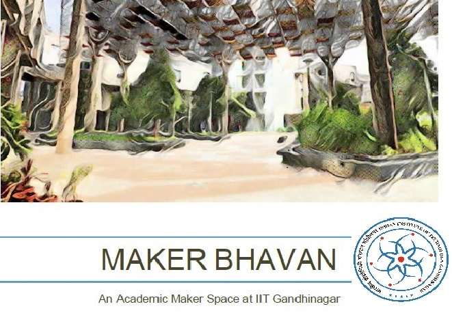
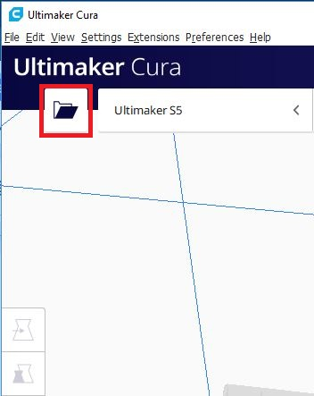

# Test-_MB-programs
This is project documentation repo for MB course projects
## adding more text to check
Check if this **works**

This is example of addling link to [Tanvir's website](http://archive.fabacademy.org/2018/labs/fablabcept/students/tanvir-khorajiya/)

Here is first image upload  

Adding another image  

